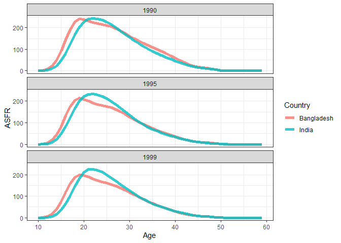

UN API Test
================
Carl Schmertmann
13 July 2022

### Purpose

This is an example to test the new API for the UN’s World Population
Propects, described at
<https://population.un.org/dataportal/about/dataapi>. This is not an
exhaustive tutorial, just a single example.

My personal preference is to skip the JSON formatting and to download in
CSV format. The API uses a vertical bar | as the csv separator
character, and csv files all seem to start with a line

> sep =|

that will need to be skipped when converting to a tibble or data frame.

### Initial Setup and Housekeeping

``` r
library(tidyverse)
```

    ## Warning: package 'tidyverse' was built under R version 4.0.4

    ## Warning: package 'ggplot2' was built under R version 4.0.4

    ## Warning: package 'tibble' was built under R version 4.0.4

    ## Warning: package 'readr' was built under R version 4.0.4

    ## Warning: package 'purrr' was built under R version 4.0.4

    ## Warning: package 'stringr' was built under R version 4.0.4

    ## Warning: package 'forcats' was built under R version 4.0.4

``` r
base_url = 'https://population.un.org/dataportalapi/api/v1'
```

### Available Topics

We can get a list of “topics” like this

``` r
target = paste0(base_url, '/topics/?format=csv')

df_topics = read.csv(target, sep='|', skip=1)

df_topics
```

    ##    Id                    Name  ShortName SortOrder
    ## 1   0          Not applicable       <NA>         0
    ## 2   1              Population        Pop         1
    ## 3   2               Fertility       Fert         2
    ## 4   3               Mortality       Mort         3
    ## 5   4 International Migration iMigration         4
    ## 6   5         Family Planning         FP         5
    ## 7   6          Marital Status    MarStat         6
    ## 8   7          All Components        All         7
    ## 9   8         Child Mortality       IGME         8
    ## 10  9      Maternal Mortality      MMEIG         9

Each topic has an id\#, a full name, and a short name. We’ll try
2/Fertility/Fert and look at the available variables for that topic.

### Indicators

``` r
target = paste0(base_url,'/indicators/?format=csv')

df_indicators = read.csv(target, sep='|', skip=1) %>% 
                   filter(TopicName == 'Fertility')

# what are the column names for the indicators info?
names(df_indicators)
```

    ##  [1] "Id"                       "Name"                    
    ##  [3] "ShortName"                "Description"             
    ##  [5] "DisplayName"              "DimAge"                  
    ##  [7] "DimSex"                   "DimVariant"              
    ##  [9] "DimCategory"              "DefaultAgeId"            
    ## [11] "DefaultSexId"             "DefaultVariantId"        
    ## [13] "DefaultCategoryId"        "VariableType"            
    ## [15] "ValueType"                "UnitScaling"             
    ## [17] "Precision"                "IsThousandSeparatorSpace"
    ## [19] "FormatString"             "UnitShortLabel"          
    ## [21] "UnitLongLabel"            "NClassesDefault"         
    ## [23] "DownloadFileName"         "SourceId"                
    ## [25] "SourceName"               "SourceYear"              
    ## [27] "SourceStartYear"          "SourceEndYear"           
    ## [29] "SourceCitation"           "SourceUrl"               
    ## [31] "TopicId"                  "TopicName"               
    ## [33] "TopicShortName"

The indicators have lots of detailed information in all of those
columns, but the most interesting are the first few columns. Let’s peek
at those, plus the starting and ending years for the available data
series.

``` r
df_indicators %>% 
   select(Id:ShortName, SourceStartYear, SourceEndYear)
```

    ##   Id                                      Name ShortName SourceStartYear
    ## 1 17 Fertility rates by age of mother (5-year)     ASFR5            1950
    ## 2 18         Mean age of childbearing (5-year)      MAC5            1950
    ## 3 19                  Total fertility (5-year)      TFR5            1950
    ## 4 55                          Crude birth rate       CBR            1950
    ## 5 56                     Net Reproduction Rate       NRR            1950
    ## 6 57                       Total births by sex   TBirths            1950
    ## 7 58                        Sex ratio at birth       SRB            1950
    ## 8 68 Fertility rates by age of mother (1-year)     ASFR1            1950
    ##   SourceEndYear
    ## 1          2100
    ## 2          2100
    ## 3          2100
    ## 4          2100
    ## 5          2100
    ## 6          2100
    ## 7          2100
    ## 8          2100

Let’s try the single-year age-specific rates: the ID\# for that variable
is **68** and the short name is **ASFR1**. Estimates are available from
1950 to 2100.

### Locations

Before grabbing data for this variable, we’ll need to select a
population (or populations) for which we want the ASFRs. To see the
available list we can use the API again:

``` r
target = paste0(base_url, '/locations?sort=id&format=csv')

df_locations = read.csv(target, sep='|', skip=1)

# how many locations?

nrow(df_locations)
```

    ## [1] 277

``` r
# print the first 20 observations
df_locations %>% 
  head(20)
```

    ##    Id ParentId                             Name Iso3 Iso2 LocationTypeId
    ## 1   4     5501                      Afghanistan  AFG   AF              4
    ## 2   8      925                          Albania  ALB   AL              4
    ## 3  12      912                          Algeria  DZA   DZ              4
    ## 4  16      957                   American Samoa  ASM   AS              4
    ## 5  20      925                          Andorra  AND   AD              4
    ## 6  24      911                           Angola  AGO   AO              4
    ## 7  28      915              Antigua and Barbuda  ATG   AG              4
    ## 8  31      922                       Azerbaijan  AZE   AZ              4
    ## 9  32      931                        Argentina  ARG   AR              4
    ## 10 36      927                        Australia  AUS   AU              4
    ## 11 40      926                          Austria  AUT   AT              4
    ## 12 44      915                          Bahamas  BHS   BS              4
    ## 13 48      922                          Bahrain  BHR   BH              4
    ## 14 50     5501                       Bangladesh  BGD   BD              4
    ## 15 51      922                          Armenia  ARM   AM              4
    ## 16 52      915                         Barbados  BRB   BB              4
    ## 17 56      926                          Belgium  BEL   BE              4
    ## 18 60      905                          Bermuda  BMU   BM              4
    ## 19 64     5501                           Bhutan  BTN   BT              4
    ## 20 68      931 Bolivia (Plurinational State of)  BOL   BO              4
    ##    LocationType   Longitude  Latitude
    ## 1       Country   67.709953  33.93911
    ## 2       Country   20.168331  41.15333
    ## 3       Country    1.659626  28.03389
    ## 4       Country -170.696182 -14.30602
    ## 5       Country    1.521801  42.50629
    ## 6       Country   17.873886 -11.20269
    ## 7       Country  -61.789180  17.07867
    ## 8       Country   47.576927  40.14310
    ## 9       Country  -63.616673 -38.41610
    ## 10      Country  133.775131 -25.27440
    ## 11      Country   14.550072  47.51623
    ## 12      Country  -77.396278  25.03428
    ## 13      Country   50.557701  26.06670
    ## 14      Country   90.356331  23.68499
    ## 15      Country   45.038189  40.06910
    ## 16      Country  -59.556430  13.16705
    ## 17      Country    4.469936  50.50389
    ## 18      Country  -64.750504  32.30780
    ## 19      Country   90.433601  27.51416
    ## 20      Country  -63.588654 -16.29015

``` r
# find the codes for India and Bangladesh

df_locations %>% 
   filter( Name %in% c('India','Bangladesh'))
```

    ##    Id ParentId       Name Iso3 Iso2 LocationTypeId LocationType Longitude
    ## 1  50     5501 Bangladesh  BGD   BD              4      Country  90.35633
    ## 2 356     5501      India  IND   IN              4      Country  78.96288
    ##   Latitude
    ## 1 23.68499
    ## 2 20.59368

### Retrieve a specific indicator for a selected country

Suppose we want to compare single-year fertility rates in India and
Bangladesh during the 1990s. That is indicator 68 (ASFR1), for location
IDs 50 (Bangladesh) and 356 (India).

The URL for that specific query is the base\_url +

> /data/indicators/68/locations/50,356/start/1990/end/1999/?format=csv

Let’s try it:

``` r
my_indicator = 68
my_location  = '50,356'
my_startyr   = 1990
my_endyr     = 1999

target = paste0(base_url,
                '/data/indicators/',my_indicator,
                '/locations/',my_location,
                '/start/',my_startyr,
                '/end/',my_endyr,
                '/?format=csv')

target
```

    ## [1] "https://population.un.org/dataportalapi/api/v1/data/indicators/68/locations/50,356/start/1990/end/1999/?format=csv"

``` r
df_data = read.csv(target, sep='|', skip=1)

# look at the data's structure

dim(df_data)
```

    ## [1] 1000   32

``` r
names(df_data)
```

    ##  [1] "LocationId"           "Location"             "Iso3"                
    ##  [4] "Iso2"                 "LocationTypeId"       "IndicatorId"         
    ##  [7] "Indicator"            "IndicatorDisplayName" "SourceId"            
    ## [10] "Source"               "Revision"             "VariantId"           
    ## [13] "Variant"              "VariantShortName"     "VariantLabel"        
    ## [16] "TimeId"               "TimeLabel"            "TimeMid"             
    ## [19] "CategoryId"           "Category"             "EstimateTypeId"      
    ## [22] "EstimateType"         "EstimateMethodId"     "EstimateMethod"      
    ## [25] "SexId"                "Sex"                  "AgeId"               
    ## [28] "AgeLabel"             "AgeStart"             "AgeEnd"              
    ## [31] "AgeMid"               "Value"

``` r
# peek at a random bit of the dataframe

df_data %>% 
  sample_n(size=20) %>% 
  select(Location, starts_with('Age'), starts_with('Time'), Value) %>% 
  as_tibble()
```

    ## # A tibble: 20 x 10
    ##    Location   AgeId AgeLabel AgeStart AgeEnd AgeMid TimeId TimeLabel TimeMid
    ##    <chr>      <int>    <int>    <int>  <int>  <int>  <int>     <int>   <dbl>
    ##  1 Bangladesh    98       50       50     50     50     49      1998   1998.
    ##  2 India         92       20       20     20     20     45      1994   1994.
    ##  3 Bangladesh   118       21       21     21     21     49      1998   1998.
    ##  4 Bangladesh   118       21       21     21     21     43      1992   1992.
    ##  5 Bangladesh   136       41       41     41     41     48      1997   1998.
    ##  6 India        140       46       46     46     46     42      1991   1992.
    ##  7 India        125       29       29     29     29     50      1999   2000.
    ##  8 Bangladesh   109       11       11     11     11     44      1993   1994.
    ##  9 India        128       32       32     32     32     50      1999   2000.
    ## 10 India        122       26       26     26     26     50      1999   2000.
    ## 11 India        119       22       22     22     22     49      1998   1998.
    ## 12 Bangladesh   115       18       18     18     18     45      1994   1994.
    ## 13 India        127       31       31     31     31     47      1996   1996.
    ## 14 Bangladesh   147       54       54     54     54     42      1991   1992.
    ## 15 Bangladesh   128       32       32     32     32     50      1999   2000.
    ## 16 India        133       38       38     38     38     46      1995   1996.
    ## 17 India        151       59       59     59     59     42      1991   1992.
    ## 18 Bangladesh   147       54       54     54     54     43      1992   1992.
    ## 19 India        149       57       57     57     57     48      1997   1998.
    ## 20 India         95       35       35     35     35     45      1994   1994.
    ## # ... with 1 more variable: Value <dbl>

Now that we know what the data structure looks like, let’s plot the
1990, 1995, and 1999 ASFR schedules for the two countries.

``` r
# make a new data frame with the data of interest
df = df_data %>% 
      select(Country=Location, Year=TimeLabel,Age=AgeMid,ASFR=Value) %>% 
       filter(Year %in% c(1990,1995,1999))

# construct a plot

ggplot(data=df) +
  aes(x=Age, y=ASFR, group=Country, color=Country) +
  geom_line(lwd=2, alpha=.80) +
  scale_y_continuous(breaks=seq(0,300,100),
                     minor_breaks = seq(0,300,50)) +
  theme_bw() +
  facet_wrap(~Year, ncol=1)
```

<!-- -->
